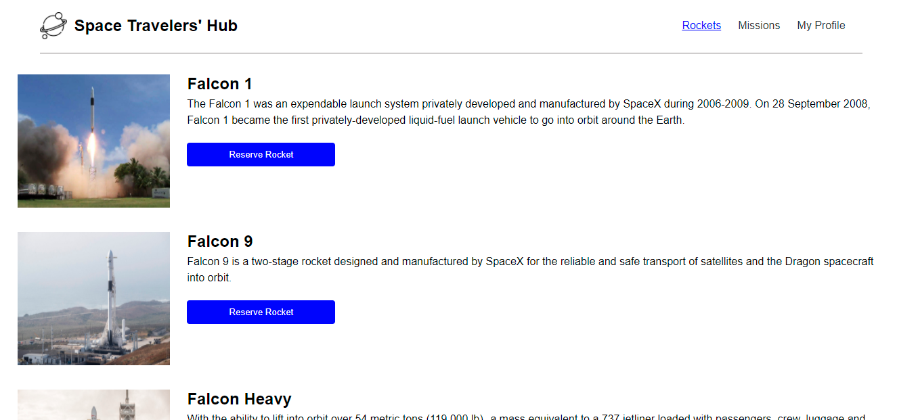
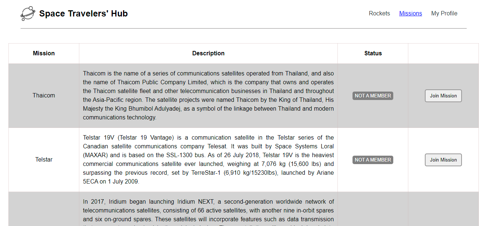
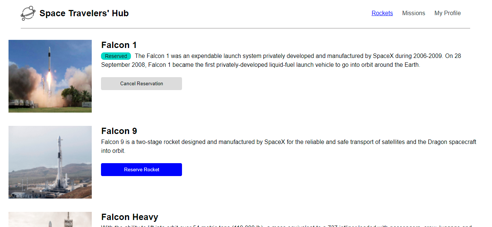
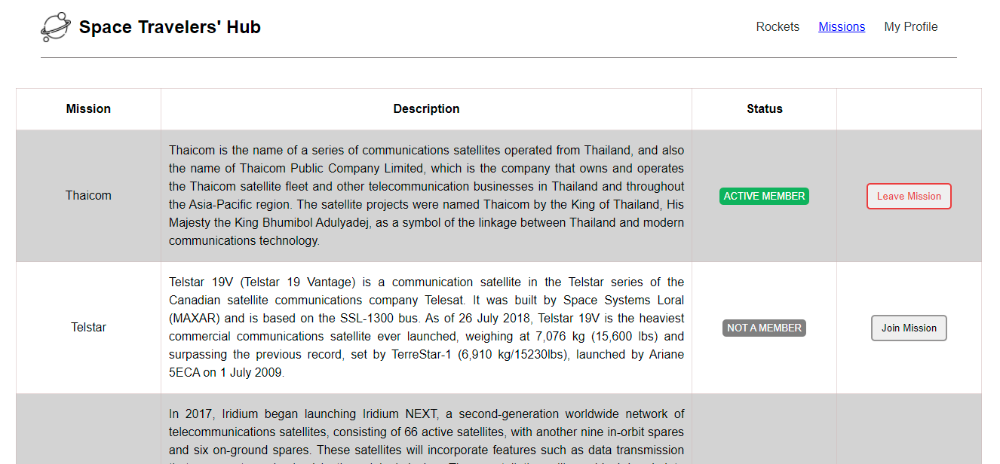
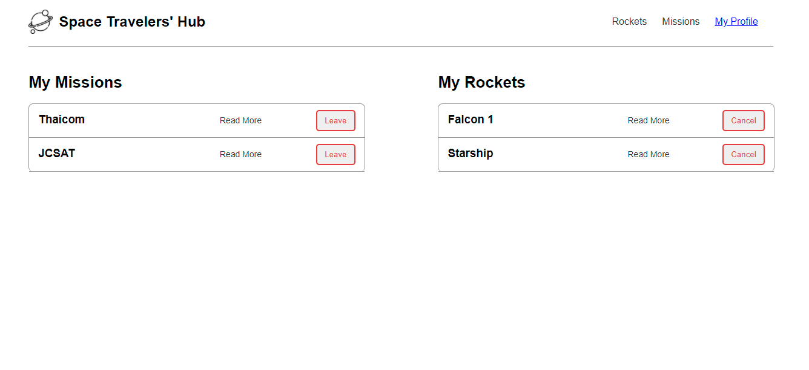

# Space Travelers

This is web application for a company that provides commercial and scientific space travel services. The application will allow users to book rockets and join selected space missions.
We work with  data from the SpaceX API.












## Live Demo

[Live Demo Link](https://space-travelers-hub-aka.netlify.app/)

## Built 

- React
- Redux
- Linters (React & Redux)
- Git

## Get Started

Please get your browser update.

. Step 1:  To get a local copy up and running follow these simple steps.
   ```
   git clone <URL> in your terminal
   ```

. Step 2: 
   ```
   cd space-travelers-hub

   npm install

   npm run build

   npm start 
   ```

## Author

👤 **Yannick-Noel AKA**

- Location: Côte d'Ivoire
- GitHub: [@codecaiine](https://github.com/codecaiine)
- Twitter: [@yannicknaka](https://twitter.com/yannicknaka)
- LinkedIn: [LinkedIn](https://www.linkedin.com/in/yannick-no%C3%ABl-aka/)

👤 **Isabella Namutenda**

- Location: Kenya
- GitHub: [@Isabellanamutenda](https://github.com/Isabellanamutenda)

## 🤝 Contributing

Contributions, issues, and feature requests are welcome!

Feel free to check the [issues page](https://github.com/codecaiine/space-travelers-hub/issues).

## Show your support

Give a ⭐️ if you like this project!

## Acknowledgments
This project is based on  [Hamza Ellaouzi](https://github.com/Hamzaoutdoors) project.

